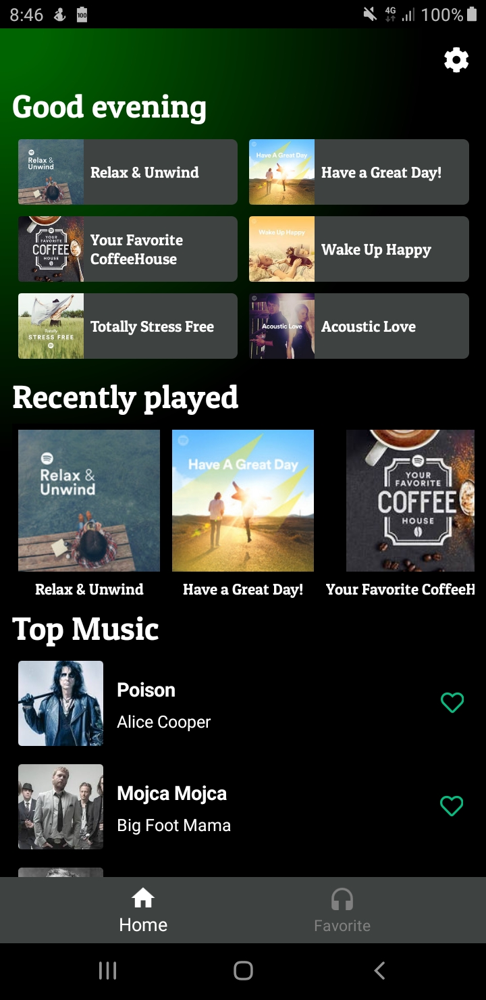
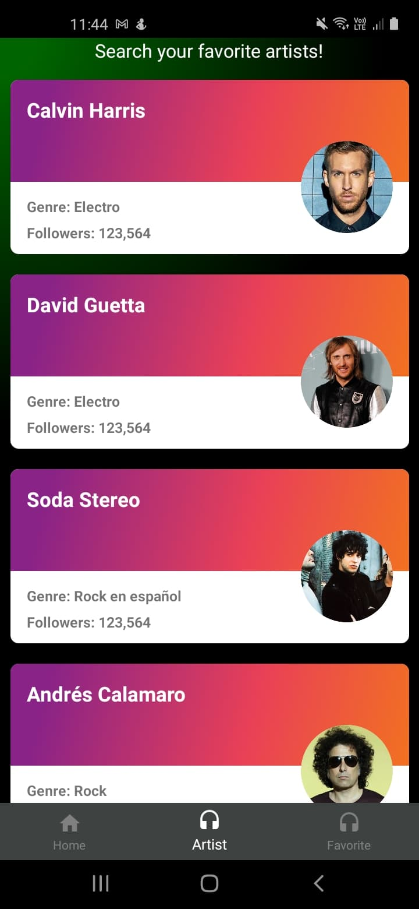
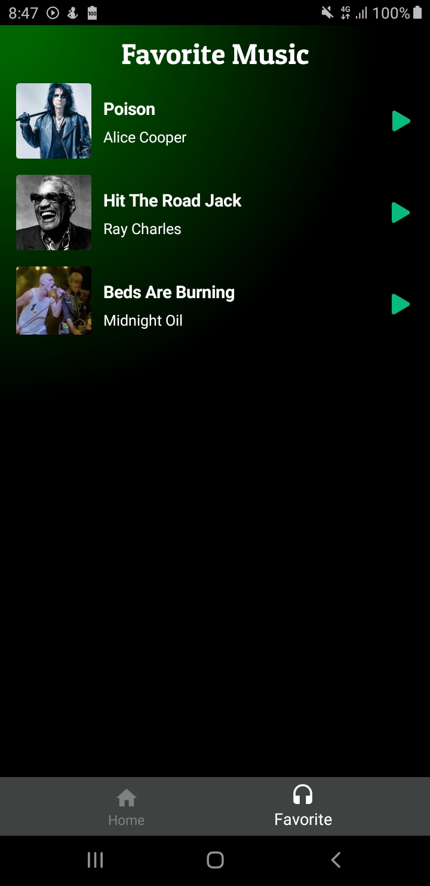
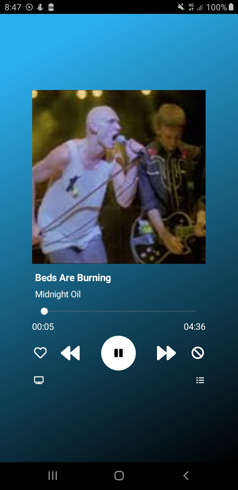

# Music-Player  
Music Player App project developed using Xamarin Forms and the following:  
- [Xamrin Forms Brushes](https://docs.microsoft.com/en-gb/xamarin/xamarin-forms/user-interface/brushes/)  
- [Xamarin Essentials](https://docs.microsoft.com/en-us/xamarin/essentials/)
- [Acr.UserDialog](https://github.com/aritchie/userdialogs)  
- [CollectionView](https://docs.microsoft.com/en-us/xamarin/xamarin-forms/user-interface/collectionview/layout)  
- [FontAwesome](https://fontawesome.com/)  
- [FFImageLoading](https://github.com/luberda-molinet/FFImageLoading)  
- [Plugin.MediaManager](https://github.com/Baseflow/XamarinMediaManager)  
- [Newtonsoft.Json](https://www.newtonsoft.com/json)  
- [PatuaOne Font](https://fonts.google.com/specimen/Patua+One)  
- [Moq](https://github.com/Moq/moq4/wiki/Quickstart)  
- [Local Db-json server](https://www.npmjs.com/package/json-server)  
- Splash Activity  
- Android Asset Studio  
- MVVM Pattern  
- Xamarin Forms 5.0.0.2012  
## GIF  
  
## IMAGES  
<table>
  <tr>
     <td>Main Page</td>
     <td>Artist Page</td>
     <td>Favorite Page</td>
     <td>Player Page</td>
  </tr>
  <tr>
    <td></td>
    <td></td>
    <td></td>
    <td></td>
  </tr>
 </table>  

## SETUP DB-JSON SERVER AND TEST ON MOBILE PHONES   
1. Install json-server following this [link](https://www.npmjs.com/package/json-server).  
2. Locate the file db.json on the **resources** folder.  
3. Open cmd, move to the db.json route and run this command `json-server --watch db.json` (the dafault port is 3000).
4. Open a new tab on Google Chrome `chrome://inspect/#devices` and connect your mobile phone.  

  
5. Click on Port forwading.  
6. Add a new port, for this case 3000 - localhost:3000.  
7. Check **Enable port forwarding**.  
8. Click on Done.  

  
9. Verify localhost on your mobile phone.  

  
10. Have fun with **MusicPlayer App** :call_me_hand: :musical_note: :headphones: 
    
